<div align="center">

# 🛡️ Structura
### *The Unbreakable AI Data Architect*

[](https://python.org)
[](https://ai.pydantic.dev/)
[](https://fastht.ml/)
[](https://ai.google.dev/)
[](https://www.docker.com/)

[View Live Demo](https://huggingface.co/spaces/EATosin/Structura) • [System Architecture](#-system-architecture) • [Deploy Now](#-deployment)


</div>

---

## ⚡ The Problem: "Data Chaos"
AI models usually output messy text. If you ask GPT for JSON, it might give you `json` markdown blocks, extra commentary, or missing fields. This breaks downstream applications.

## 🧠 The Solution: Type-Safe Generation
**Structura** is a deterministic extraction engine.
It uses **PydanticAI** to enforce strict schema validation *during* the generation process. If the AI makes a mistake, the framework catches it and auto-corrects before the user ever sees it.

> *"Stop asking the AI to 'be careful'. Force it to be correct."*

---

## ✨ Key Features

| Feature | Description |
| :--- | :--- |
| **🛡️ Unbreakable JSON** | Outputs are guaranteed to match your Pydantic Models. Zero parsing errors. |
| **🔄 Self-Healing Loop** | If the LLM output fails validation, the agent automatically retries with error context. |
| **⚡ Hyper-Fast UI** | Built with **FastHTML** (HTMX), delivering SPA-like performance without heavy JavaScript frameworks. |
| **🧠 SOTA Intelligence** | Powered by **Gemini 2.5 Flash** (1M Context Window) for processing massive unstructured documents. |
| **📱 Mobile Native** | Lightweight architecture designed to run on Edge devices, Pydroid 3, and Serverless Containers. |

---

## ⚙️ System Architecture

Structura separates the **Business Logic** (Schemas) from the **AI Logic** (Agents).

```mermaid
graph LR
    A[User Input<br>Messy Text/OCR] --> B(FastHTML Interface)
    B --> C{PydanticAI Agent}
    C -->|Gemini 2.5| D[Draft Extraction]
    D --> E{Validation Gate}
    E -->|❌ Error| C
    E -->|✅ Valid| F[Structured JSON]
    F --> G[Download / API Response]

    style E fill:#00E5FF,stroke:#333,stroke-width:2px,color:black
    style F fill:#99ff99,stroke:#333,stroke-width:2px,color:black
```



### The "SOTA" Stack
*   **Framework:** `PydanticAI` (Validation-First Generation)
*   **Model:** `Gemini 2.5 Flash` (High speed, low cost)
*   **Frontend:** `FastHTML` (Pure Python Web App)
*   **Config:** `YAML` Externalized Prompts

---

## 📦 Directory Structure

A clean, modular architecture designed for scalability.

```text
Structura/
├── app/                  # FastHTML Frontend
│   ├── main.py           # Application Routes
│   └── components.py     # UI Design System (PicoCSS)
├── agents/               # AI Logic Layer
│   ├── extractor.py      # The Self-Healing Agent
│   └── models.py         # Pydantic Data Schemas
├── prompts/              # Configuration
│   └── system.yaml       # Master System Prompt (SOTA)
├── utils/                # Helpers
│   ├── client.py         # API Auth & Config
│   └── prompt_loader.py  # YAML Parser
├── Dockerfile            # Production Container
├── requirements.txt      # Dependency Lock
└── run.py                # Server Entry Point
```

---

## 🚀 Quick Start

### Prerequisites
*   Python 3.11+
*   Google Gemini API Key

### 1. Installation
```bash
git clone https://github.com/eatosin/Structura.git
cd Structura
pip install -r requirements.txt
```

### 2. Configuration
Create a `.env` file in the root directory:
```env
GEMINI_API_KEY=AIza...
PORT=7860
```

### 3. Run the Engine
```bash
python run.py
```
*Access the dashboard at `http://localhost:7860`*

---

## 🐋 Deployment (Docker)

Structura is cloud-agnostic. Deploy to Hugging Face Spaces, Render, or AWS ECS with a single command.

```bash
docker build -t structura .
docker run -p 7860:7860 --env-file .env structura
```

---

## 📈 Star History

[](https://star-history.com/#Eatosin/Structura&Date)

---

## 👨‍💻 Author
**Owadokun Tosin Tobi**
*Senior AI Engineer & Physicist*

*   **Portfolio:** [GitHub](https://github.com/eatosin)
*   **Connect:** [LinkedIn](https://www.linkedin.com/in/owadokun-tosin-tobi/)

---
*Built with the Lexpertz R&D 2026 Stack.*
